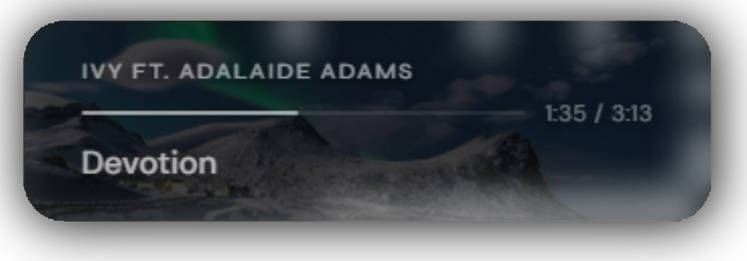

# Spotify Now Playing Overlay

A clean, minimal OBS browser source overlay that shows your currently playing track from Spotify. Displays artist, track title, a play timer, and an optional real-time audio spectrum visualizer on the card border. Album art is used as the card background automatically.

[](https://youtu.be/YbRZDitaOi4)

---

## Requirements

- **Spotify Premium** account (the Web API does not work with free accounts)
- A **Spotify Developer app** — free to create at [developer.spotify.com](https://developer.spotify.com)
- **Python 3.8+** — only needed for the spectrum visualizer (optional)

---

## Setup

### 1. Create a Spotify Developer app

1. Go to [developer.spotify.com/dashboard](https://developer.spotify.com/dashboard) and log in
2. Click **Create app**
3. Fill in any name and description
4. Set the **Redirect URI** to exactly: `http://127.0.0.1:8082/callback`
5. Save — you'll see your **Client ID** and **Client Secret** on the app page

### 2. Configure the server

Open `overlay-server.ps1` and fill in your credentials:

```powershell
$CLIENT_ID     = "your_client_id_here"
$CLIENT_SECRET = "your_client_secret_here"
```

### 3. File structure

Put everything in the same folder:

```
📁 your folder
   nowplaying-spotify.html
   overlay-server.ps1
   serve.bat
   spectrum-server.py      ← only needed for visualizer
```

### 4. Start the server

Double-click `serve.bat`. Both servers launch minimized to the taskbar.

On the very first run a browser window will open asking you to log in to Spotify and grant permission. After that a token is saved locally and you'll never need to log in again.

> **Tip:** Create a shortcut to `serve.bat` and prefix the target with `cmd /c` to enable pinning it to the Start Menu.

### 5. OBS browser source

Add a Browser Source in OBS and point it at:

```
http://localhost:8081/nowplaying-spotify.html
```

Set the background colour to transparent (RGBA 0,0,0,0).

---

## Spectrum visualizer (optional)

The overlay includes a real-time audio spectrum visualizer — frequency bands drawn around the inside of the card border, driven by actual FFT data from your audio device.

### Requirements

```
pip install sounddevice numpy scipy websockets
```

### Setup

1. Open `spectrum-server.py` and set `DEVICE` to match your audio input device:
   ```python
   DEVICE = 'Line 1'  # partial name match is fine
   ```
   Run `python spectrum-server.py --list` to see all available devices. You want the **capture** end of your VAC cable — the one that receives audio from your playback device.

2. Make sure `VISUALIZER: true` is set in `nowplaying-spotify.html` (it is by default)

3. `serve.bat` launches the spectrum server automatically alongside the overlay server

**If you don't want the visualizer**, set `VISUALIZER: false` in the HTML and comment out the spectrum server line in `serve.bat`:

```bat
REM start /min "Spectrum Server" python "%~dp0spectrum-server.py"
```

No Python installation needed if the visualizer is disabled.

### Visualizer config

Open `nowplaying-spotify.html` and adjust these values in the `CONFIG` block:

| Option | Default | Description |
|--------|---------|-------------|
| `SPECTRUM_PORT` | `9001` | Port spectrum-server.py runs on |
| `VIS_COLOR` | `'255, 255, 255'` | RGB color of the bars |
| `VIS_MAX_OPACITY` | `0.81` | Peak brightness of the bars |
| `VIS_BAR_DEPTH` | `24` | How far bars reach inward from the border in px |
| `VIS_BLUR` | `10` | Canvas blur — higher = more glow, lower = more defined bars |
| `VIS_SMOOTHING` | `0.27` | Response speed — lower = snappier |
| `VIS_BANDS` | `63` | Number of frequency bands around the border |
| `VIS_GAIN` | `1.0` | Amplification — increase if bars are too quiet |

> **Note:** Unlike the foobar version, the Spotify overlay uses a fixed gain value since the Spotify API does not expose the current playback volume.

### Spectrum server config

Open `spectrum-server.py` and adjust these values at the top:

| Option | Default | Description |
|--------|---------|-------------|
| `DEVICE` | `'Line 1'` | Partial name of your audio input device |
| `BANDS` | `64` | Number of frequency bands |
| `CHUNK` | `1024` | Audio buffer size — smaller = snappier transient response |
| `SMOOTHING` | `0.5` | Band smoothing — lower = more reactive |
| `GAIN` | `12.0` | Amplification — increase if bars are too quiet |
| `FREQ_MIN` | `40` | Lowest frequency to analyse (Hz) |
| `FREQ_MAX` | `16000` | Highest frequency to analyse (Hz) |

---

## Configuration

You can either use the GUI configurator.html to tweak the overlay settings with live preview. Or you can manually edit the file.  
All config options are listed below.

### CSS variables

Open `nowplaying-spotify.html` and adjust the `:root` block at the top:

| Variable | Default | Description |
|----------|---------|-------------|
| `--card-bg` | `rgba(10,10,14,0.63)` | Card background colour and opacity |
| `--card-blur` | `22px` | Backdrop blur (frosted glass effect) |
| `--card-radius` | `20px` | Corner radius |
| `--card-border` | `rgba(255,255,255,0.13)` | Subtle border around the card |
| `--card-width` | `340px` | Card width |
| `--card-height` | `auto` | Card height — set to a px value to fix it |
| `--card-padding-x` | `28px` | Left/right inner padding |
| `--card-padding-y` | `18px` | Top/bottom inner padding |
| `--img-opacity` | `0.22` | Album art background opacity |
| `--img-blur` | `0px` | Extra blur on album art |
| `--color-track` | `rgba(255,255,255,0.69)` | Track title colour |
| `--color-artist` | `rgba(255,255,255,0.58)` | Artist name colour |
| `--color-timer` | `rgba(255,255,255,0.45)` | Timer colour |
| `--color-bar-fill` | `rgba(255,255,255,0.57)` | Progress bar fill colour |
| `--marquee-speed` | `22s` | Scroll speed for long text |

### JavaScript config

| Option | Default | Description |
|--------|---------|-------------|
| `POLL_MS` | `1000` | How often the overlay checks Spotify for updates (ms) |
| `DEMO_MODE` | `false` | Set to `true` to preview with fake rotating tracks |
| `ALBUM_ART_BG` | `true` | Set to `false` to disable album art as background |

---

## Behaviour notes

- The overlay hides itself when nothing is playing on Spotify
- Album art crossfades over ~0.9 seconds on track change
- The timer interpolates smoothly between API polls so it doesn't jump every second
- Long artist and track names scroll automatically
- The server refreshes the Spotify access token automatically — no manual intervention needed
- All processing is local — your Spotify credentials never leave your machine except to talk directly to Spotify's API

---

## Ports

| Port | Used for |
|------|----------|
| `8081` | Overlay server (what OBS connects to) |
| `8082` | OAuth callback (Spotify login redirect, first run only) |
| `9001` | Spectrum server (visualizer data) |

If port `8081` conflicts with another overlay on the same machine, change `$PORT` in `overlay-server.ps1` and update the OBS browser source URL accordingly.
